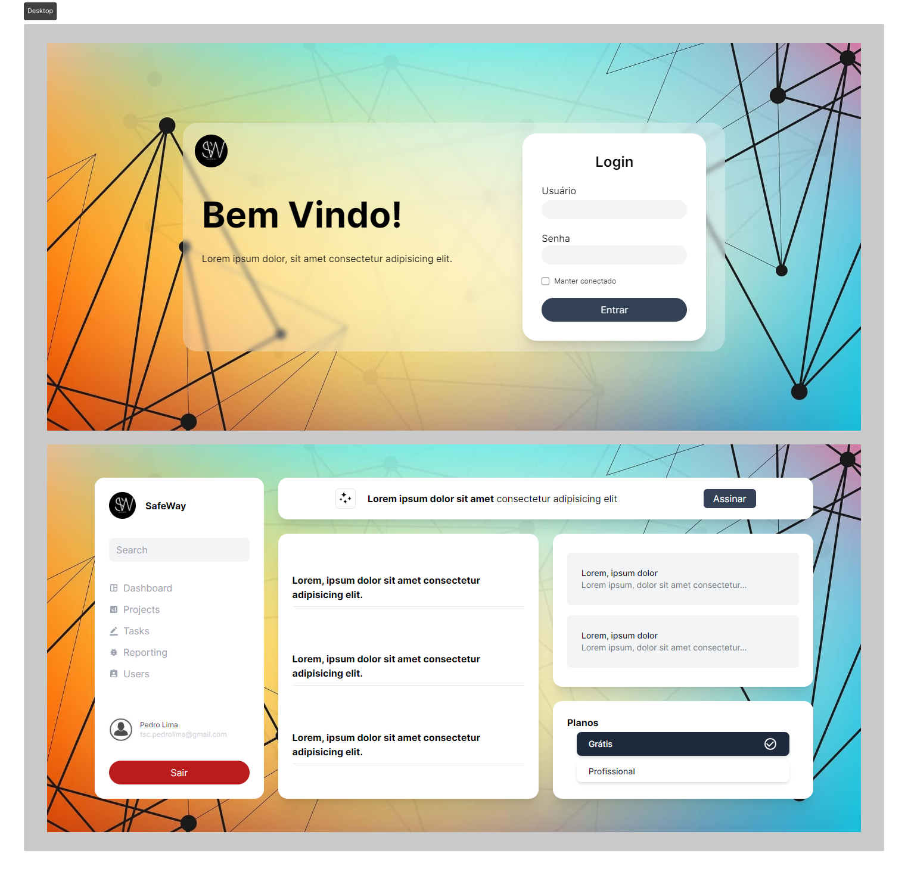

# SafeWay

Um protótipo inicial de uma plataforma SaaS que dispõe de um sistema de rotas privadas, com versões otimizadas para mobile e desktop.

O projeto é de minha autoria e foi inspirado em outras aplicações já existentes, adaptando seus designs e recursos. A aplicação foi desenvolvida utilizando tecnologias como TypeScript, Next, TailwindCSS e CSS.

## Screenshots



</br>

## 🎯 Objetivos

O principal objetivo deste projeto foi elaborar um sistema de rotas privadas utilizando o framework Next. Secundariamente, busquei familiarizar-me com o framework de estilos Tailwind CSS.

Os usuários têm a capacidade de:
- Visualizar a aplicação de maneira independente, seja em dispositivos mobile ou desktop.
- Navegar entre as páginas de login e dashboard, testando o sistema de rotas privadas. 

> OBS - A rota privada do dashboard só poderá ser acessada se o usuário possuir o token, o qual é obtido ao clicar no botão 'Entrar' no formulário de login. Da mesma forma, a rota pública raiz, onde se encontra o formulário de login, só poderá ser acessada se o usuário não possuir o token. Para excluir o token, é necessário clicar no botão 'Sair' na barra de navegação do dashboard (na versão mobile, o botão está no menu).

</br>

## 🔧 Propriedades e Tecnologias

- TypeScript
- Next 
- TailwindCSS
- CSS
- ESLint

</br>

## 🧠 Meu aprendizado

O Next.js, oferece uma poderosa funcionalidade de sistema de rotas privadas através do uso de middlewares. Este recurso permite criar aplicações web seguras e controlar o acesso a determinadas rotas com facilidade. Ao implementar middlewares específicos, é possível adicionar camadas adicionais de autenticação, autorização e lógica personalizada às rotas privadas, garantindo que apenas usuários autorizados tenham acesso a determinados recursos.

Conforme a documentação recomenda, é necessário criar o arquivo middleware.js/ts na raiz do seu projeto.

```tsx
import { NextResponse } from "next/server";
import { NextRequest } from "next/server";
 
export function middleware(request: NextRequest) {
  // Busca e pega o valor do token
  const token = request.cookies.get("auth_user")?.value;
  // Se o token não existir
  if (!token) {
    // E se o usuário estiver na rota "/"
    if (request.nextUrl.pathname == "/") {
      // Prossiga sem encaminhar
      return NextResponse.next();
    }
    // Encaminha o usuário para a rota "/"
    return NextResponse.redirect(new URL("/", request.url));
  }
  //Se o token existir e o usuário quiser acessar a rota "/"
  if (request.nextUrl.pathname == "/") {
    // Encaminhe o usuário para a rota "dashboard"
    return NextResponse.redirect(new URL("/dashboard", request.url));
  }
}

export const config = {
  // Rotas afetadas
  matcher: ["/", "/dashboard/:path*"]
};
```

O arquivo é composto pela função middleware e um objeto de configuração chamado "matcher".

A função middleware recebe o parâmetro "request", que nos concede acesso aos cookies e componentes da URL da web. Isso nos permite instanciar o token para trabalhar com condições baseadas nele. Outro elemento crucial é o "NextResponse", o qual precisamos importar de "next/server". Ele nos possibilita direcionar as rotas para onde o usuário será encaminhado.

O objeto "matcher" será responsável por definir quais rotas serão impactadas pela função middleware.

> Para saber mais consulte a [documentação!](https://nextjs.org/docs/app/building-your-application/routing/middleware)

</br>

## 💻 Rodando o projeto


Para conferir a versão final é só realizar os seguintes passos:

### 1 - Clonando o Projeto:
Navegue até o diretório onde deseja clonar o projeto.

Abra o terminal com o GitBash.

Execute o comando:

```bash
git clone URL_DO_REPOSITORIO
```
Substitua URL_DO_REPOSITORIO pela URL do repositório deste projeto.

### 2 - Instalando Dependências:
Navegue até o diretório "safeway".

Execute o comando:

```bash
npm install
```
ou
```bash
yarn install
```

### 3 - Executando o Projeto:
Ainda no diretório "safeway".

Execute o comando:

```bash
npm run dev
```
Isso iniciará o servidor de desenvolvimento Next.

</br>

## Autor

- LinkedIn - [Pedro A. Lima](https://www.linkedin.com/in/pedroalima6/)
